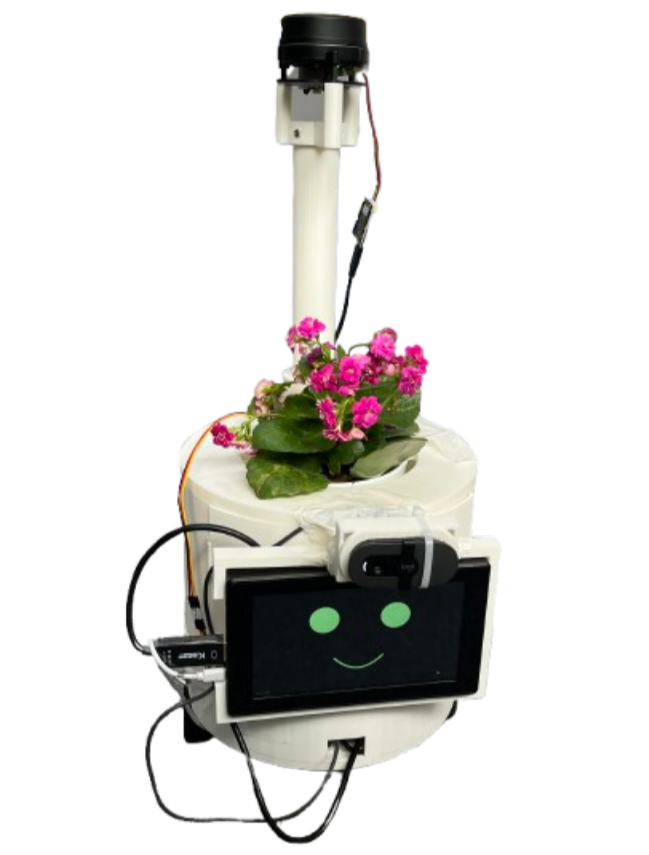
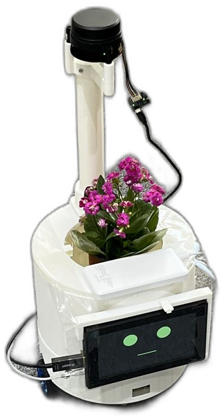
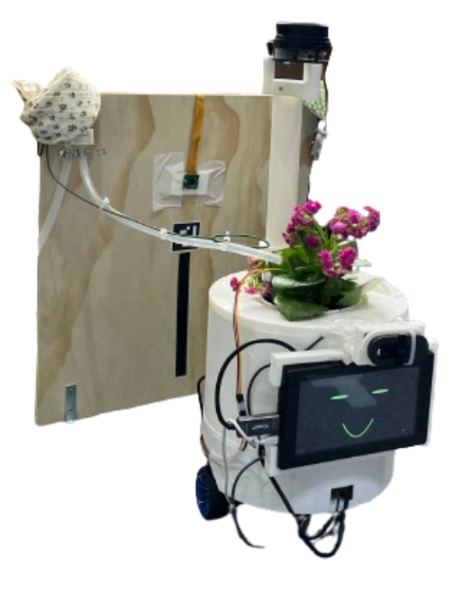
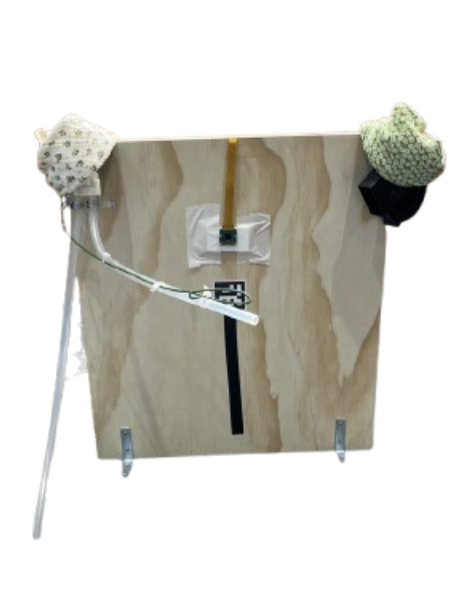
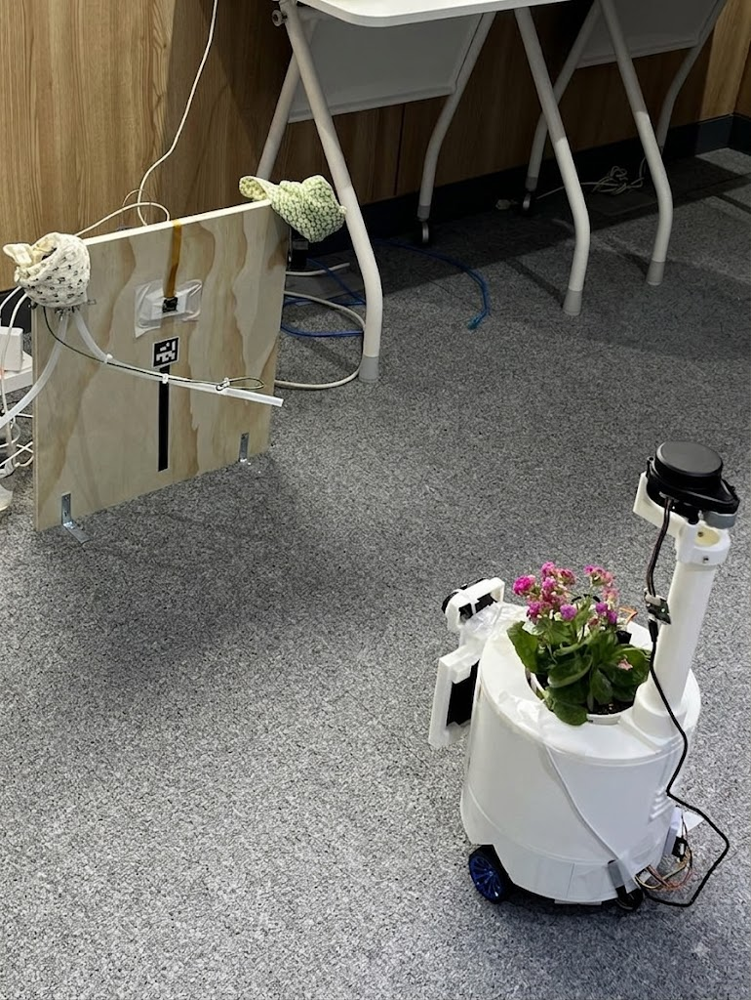

# Potner — 반려식물 AIoT 로봇 (Robot 파트)

> Pot + Partner. 스스로 판단하고 움직이며 사용자와 교감하는 반려식물 로봇.
> SSAFY 15기 공통PJT · E104 친구사이

<p align="center">
  
</p>

이 저장소의 `Robot-master` 브랜치는 **로봇 본체(Jetson Orin Nano)** 소프트웨어를
담당합니다. 다른 파트는 별도 브랜치에 있습니다 — `App-master`(Flutter),
`Server-master`(Spring Boot), `Raspberry-master`(장치 스테이션).

## 무엇을 하는 로봇인가

포트너는 **화분을 싣고 다니는 로봇**입니다. 판단은 서버가, 수행은 로봇이
맡습니다.

- **자율 급수·송풍** — 서버가 센서를 보고 급수나 송풍이 필요하다고 판단하면
  임무를 내리고, 로봇은 어느 위치에 있든 SLAM 지도 위에서 장치 스테이션까지
  찾아갑니다. ArUco 마커로 정밀 도킹하면 스테이션(라즈베리파이)이 급수·송풍을
  수행하고, 끝나면 대기 장소로 복귀합니다.
- **매일 사진 촬영** — 매일 스테이션에 도킹해 스테이션 카메라로 식물 사진을
  찍고, 생육 기록을 남깁니다.
- **햇빛 찾아가기·귀가 마중** — 서버의 좌표 명령(`command/navigate`)으로
  창가 등 지정 위치로 이동하고, 사용자가 귀가하면 현관에서 맞이합니다
  (LiDAR 사람 감지).
- **음성 대화** — 말을 걸면 STT→LLM→TTS로 식물 페르소나가 답합니다. 센서
  실측값과 어긋나는 답은 사실성 검증이 걸러냅니다.
- **표정** — 7인치 화면이 상태에 따라 표정을 바꿉니다.
- **안전 정지** — LiDAR·범퍼 감지가 다른 모든 주행 명령보다 우선합니다.

## 완성 모습 (2026-08-10 시연)

| 전체 모습 — 라이다 기둥과 화분 | 스테이션 도킹 |
|:---:|:---:|
|  |  |
| **장치 스테이션 — 펌프·카메라·ArUco 마커** | **시연장 전경** |
|  |  |

### 시연 영상

| 자동 급수 전체 시나리오 | 스테이션 자동 도킹과 급수 |
|:---:|:---:|
|  |  |
| 물이 부족하면 임의의 위치에서 스테이션을 찾아가<br>필요한 행동을 마치고 대기 장소로 복귀 | 마커 도킹부터 급수까지 가까이에서 본 장면 |

## 시스템 구성

```
① Jetson Orin Nano — 판단
   ├ USB ─ LiDAR (YDLIDAR X4 Pro), 카메라 (BRIO 100), 스피커
   ├ DP ─ 액티브 어댑터 ─ 7인치 LCD 1024x600 (표정)
   │      ⚠️ 젯슨에 HDMI 단자가 없습니다. 패시브 어댑터는 동작하지
   │         않습니다 → docs/JETSON_DISPLAY.md
   ├ I2C ─ BH1750 조도, ADS1115 ─ 정전식 토양 수분
   └ USB ─────┐
              │
② ESP32 — 모터 (실시간)
   ├ PWM 20kHz ─ BTS7960 #1 ═ 좌 구동모터 (FIT0403)
   ├ PWM 20kHz ─ BTS7960 #2 ═ 우 구동모터 (FIT0403)
   └ 레벨시프터 ─ 엔코더 A/B ×2

③ 전원 — 분리
   4S 배터리 ─ Jetson
   3S 배터리(BMS) ─ 20A 지연형 퓨즈 ─ XT60 ─ BTS7960 ═ 모터
   ⚠️ 두 팩의 GND는 반드시 한 가닥으로 연결 (플러스는 절대 금지)
```

**역할을 나눈 이유** — 엔코더는 초당 약 2,930카운트 × 2개가 들어옵니다.
리눅스는 실시간 OS가 아니라 파이썬으로 이걸 세면 카운트를 흘리고, 그러면
오도메트리가 틀어져 Nav2와 AMCL이 통째로 무너집니다. 그래서 실시간이
필요한 일(엔코더, PID, PWM)은 ESP32가, 판단이 필요한 일(경로계획, 비전,
서버 연동)은 젯슨이 맡습니다.

## 디렉토리 구조

이 저장소의 루트가 곧 **colcon 워크스페이스**입니다.

```
src/
├── potner_base/          젯슨 ↔ ESP32 통신, 차동 구동 기구학, 오도메트리
│   └── kinematics.py         ★ 순수 로직 (CI에서 테스트)
│   └── serial_protocol.py    ★ 순수 로직 (CI에서 테스트)
├── potner_description/   URDF 형상 정의, RViz 설정
├── potner_bringup/       launch 파일과 전체 파라미터
├── potner_perception/    YOLO 사람 인식, ArUco 마커 탐지
├── potner_docking/       스테이션 정밀 도킹 (마커 기반 P 제어)
├── potner_mission/       임무 상태 머신, 최우선 안전 정지
├── potner_bridge/        MQTT ↔ ROS 2 브리지 (서버·스테이션 연동)
├── potner_msgs/          커스텀 메시지·액션 정의
├── potner_llm/           LLM 응답 파이프라인 (담당: LLM 파트)
└── potner_firmware/      ESP32 펌웨어 (PlatformIO, ROS 패키지 아님)

voice-chat-server/        음성 대화 웹서버 (담당: LLM 파트)
plant-robot-chat/         노트북용 웹 챗 테스트 앱 (Next.js) — voice-chat-server의
                          LLM_BACKEND=webchat 이 이 앱의 /api/chat 을 호출
tools/                    수동 실행 도구 (회전 보정, 시연 조종기, Nav2 액션 목)
tests/                    CI용 단위 테스트 (ROS 없이 순수 로직만)
docs/                     명세·환경 문서 (아래 표 참고), media/ 는 시연 사진·영상
legacy/                   ROS 2 전환 이전 코드 (참고용, 실행되지 않음)
```

| 문서 | 내용 |
|---|---|
| [`docs/CODE_STYLE.md`](docs/CODE_STYLE.md) | 팀 코드 스타일 규칙 |
| [`docs/DEVICE-JETSON.md`](docs/DEVICE-JETSON.md) | **젯슨이 할 일만 추린 서버 연동 명세 (서버 팀 관리, 가장 실전적) — 먼저 읽을 것** |
| [`docs/DEVICE-MQTT.md`](docs/DEVICE-MQTT.md) | 장치 공통 계약과 설계 근거 (서버 팀 관리) |
| [`docs/DEVICE-RASPBERRY.md`](docs/DEVICE-RASPBERRY.md) | 스테이션(라즈베리) 쪽 명세 — 참고용 |
| [`docs/MQTT_CONTRACT.md`](docs/MQTT_CONTRACT.md) | MQTT 로봇 쪽 구현 노트 |
| [`docs/NAVIGATE_TEST.md`](docs/NAVIGATE_TEST.md) | `command/navigate` 확인 절차 |
| [`docs/ARRIVAL_TEST.md`](docs/ARRIVAL_TEST.md) | 귀가 마중 확인 절차 |
| [`docs/JETSON_DISPLAY.md`](docs/JETSON_DISPLAY.md) | 젯슨 화면 세팅 (표정 표시 전 필독) |
| [`docs/WIRING.md`](docs/WIRING.md) | 장치별 배선·핀·역할 |
| [`docs/LLM_CAPABILITIES.md`](docs/LLM_CAPABILITIES.md) | 대화 LLM이 답할 수 있는 것/없는 것 |
| [`docs/LLM_QUESTION_EXAMPLES.md`](docs/LLM_QUESTION_EXAMPLES.md) | 시연·데모용 질문 카탈로그 |
| [`docs/LLM_SENSOR_INTEGRATION_PLAN.md`](docs/LLM_SENSOR_INTEGRATION_PLAN.md) | LLM 센서 실측값 연동 계획·전환 절차 |
| [`docs/SERVER_REQUEST_SENSOR_AUTH.md`](docs/SERVER_REQUEST_SENSOR_AUTH.md) | 서버 팀 요청 기록 — 장치용 센서 조회 인증 |

**노드 파일과 계산 로직을 파일 단위로 분리**한 것이 설계의 핵심입니다.
`kinematics.py` 같은 순수 모듈은 rclpy를 import 하지 않아서 젯슨 없이도
노트북과 CI 서버에서 검증할 수 있습니다.

## 시작하기

### 1. 사전 요구사항

- Jetson Orin Nano, JetPack 6 (Ubuntu 22.04 jammy)
- ROS 2 Humble — [공식 설치 문서](https://docs.ros.org/en/humble/Installation/Ubuntu-Install-Debians.html)

```bash
sudo apt install -y ros-dev-tools ros-humble-navigation2 ros-humble-nav2-bringup \
  ros-humble-slam-toolbox ros-humble-twist-mux ros-humble-robot-state-publisher \
  ros-humble-xacro ros-humble-v4l2-camera ros-humble-tf2-tools
```

`~/.bashrc` 에 아래를 넣으세요. `ROS_DOMAIN_ID` 를 팀 번호로 고정하지
않으면 **교육장의 다른 팀 ROS 기기와 토픽이 섞입니다.**

```bash
source /opt/ros/humble/setup.bash
export ROS_DOMAIN_ID=104
export POTNER_MQTT_PASSWORD='<브로커 비밀번호>'   # 서버 팀에게 받으세요. 저장소에 없습니다
```

비밀번호가 없으면 `mqtt_bridge` 가 접속을 포기하고 에러만 남깁니다. 계정
구조와 확인 방법은 [`docs/MQTT_CONTRACT.md`](docs/MQTT_CONTRACT.md) 를 보세요.

### 2. 워크스페이스 빌드

```bash
git clone <이 저장소> ~/potner_ws
cd ~/potner_ws
rosdep install --from-paths src --ignore-src -r -y
colcon build --symlink-install
source install/setup.bash
```

### 3. LiDAR 드라이버 설치

apt에 없어서 소스 빌드가 필요합니다. **반드시 `humble` 브랜치**를 받으세요.
기본 `master` 브랜치는 Foxy 시절 코드라 `declare_parameter` API가 바뀌어
Humble에서 빌드가 실패합니다.

```bash
# SDK
git clone https://github.com/YDLIDAR/YDLidar-SDK.git ~/YDLidar-SDK
mkdir -p ~/YDLidar-SDK/build && cd ~/YDLidar-SDK/build
cmake .. && make -j4 && sudo make install && sudo ldconfig

# ROS 2 드라이버 (humble 브랜치!)
cd ~/potner_ws/src
git clone -b humble https://github.com/YDLIDAR/ydlidar_ros2_driver.git
cd ~/potner_ws && colcon build --packages-select ydlidar_ros2_driver

# udev 등록 (/dev/ydlidar 심볼릭 링크 생성)
cd ~/potner_ws/src/ydlidar_ros2_driver/startup && sudo sh initenv.sh
```

`src/ydlidar_ros2_driver/` 는 `.gitignore` 에 있습니다. 외부 코드라 우리
저장소에 넣지 않고 각자 받습니다.

> **⚠️ `ydlidar_launch.py` 는 쓰지 마세요.**
> 그 launch는 `base_link → laser_frame` 을 2cm로 발행하는데, 우리 URDF는
> 폴 높이를 반영해 48.8cm로 발행합니다. 둘 다 켜면 같은 변환이 두 개
> 생겨 SLAM이 스캔 위치를 잡지 못합니다. `robot.launch.py` 가 드라이버
> 노드만 띄우고 파라미터는 `config/ydlidar.yaml` 로 넘깁니다.

동작 확인 (X4 Pro 기준 약 11Hz):

```bash
ros2 launch potner_bringup robot.launch.py
ros2 topic hz /scan     # 다른 터미널
```

### 4. USB 장치 이름 고정 (중요)

LiDAR와 ESP32가 **둘 다 `/dev/ttyUSB*`** 로 잡히고, 둘 다 CP210x 칩을
씁니다. 꽂는 순서나 부팅 타이밍에 따라 번호가 바뀌어서, 어느 날 갑자기
LiDAR 자리로 모터 명령이 날아갑니다.

LiDAR는 3단계의 `initenv.sh` 가 `/dev/ydlidar` 를 만들어줍니다. **ESP32는
직접 등록**해야 하는데, 두 장치의 벤더 ID가 같으므로 반드시 **시리얼 번호**로
구분해야 합니다.

```bash
# ESP32만 꽂은 상태에서 시리얼 번호 확인
udevadm info -a -n /dev/ttyUSB0 | grep -E 'idVendor|serial' | head -4
```

`/etc/udev/rules.d/99-potner.rules` 를 만들고:

```
SUBSYSTEM=="tty", ATTRS{idVendor}=="10c4", ATTRS{serial}=="<ESP32 시리얼>", SYMLINK+="ttyUSB_ESP32"
```

```bash
sudo udevadm control --reload-rules && sudo udevadm trigger
```

`config/potner_params.yaml` 의 `base_driver.serial_port` 가 이 이름을
씁니다.

**카메라도 같은 문제가 있습니다.** UVC 웹캠은 영상용과 메타데이터용
`/dev/video*` 노드를 함께 만들기 때문에 번호가 둘 이상 생기고, 어느 쪽이
영상인지는 번호로 알 수 없습니다. 게다가 그 번호가 재부팅마다 바뀝니다.
어긋나면 `v4l2_camera` 가 조용히 물러나고 `marker_detector` 는 영영 아무것도
발행하지 않아서, 도킹이 15초 뒤 "마커를 찾지 못함" 으로 끝납니다 — 원인이
카메라라는 단서가 어디에도 남지 않습니다.

카메라만 꽂은 상태에서 아래 한 줄이면 규칙이 만들어집니다. 벤더·제품 ID를
장치에서 직접 읽으므로 손으로 채워 넣을 값이 없습니다.

```bash
V=$(udevadm info -a -n /dev/video0 | grep -m1 'ATTRS{idVendor}' | tr -d ' "' | cut -d= -f3); P=$(udevadm info -a -n /dev/video0 | grep -m1 'ATTRS{idProduct}' | tr -d ' "' | cut -d= -f3); echo "SUBSYSTEM==\"video4linux\", ATTRS{idVendor}==\"$V\", ATTRS{idProduct}==\"$P\", ATTR{index}==\"0\", SYMLINK+=\"video_cam\"" | sudo tee /etc/udev/rules.d/99-potner-camera.rules
```

`ATTR{index}=="0"` 이 핵심입니다. 이게 없으면 같은 웹캠의 메타데이터 노드에도
링크가 걸려서 둘 중 아무 쪽이나 잡힙니다.

```bash
sudo udevadm control --reload-rules && sudo udevadm trigger
ls -l /dev/video_cam    # 링크가 생겼는지
python3 -c "import cv2; cap=cv2.VideoCapture('/dev/video_cam'); ok,f=cap.read(); print(ok, f.shape if ok else ''); cap.release()"
```

`robot.launch.py` 의 `camera_device` 인자가 이 이름을 기본값으로 씁니다.
규칙을 만들기 전이라면 `camera_device:=/dev/video0` 으로 넘기세요.

### 5. 단계별로 띄우기

한 번에 다 켜면 무엇이 고장났는지 알 수 없습니다. 순서대로 확인하세요.

```bash
# ① 형상 확인 — 로봇 없이 노트북에서도 됩니다
ros2 launch potner_description view_model.launch.py

# ② 로봇 본체 (센서 + 모터 + 안전 + 표정 화면)
#    SSH 에서 띄우면 표정 창이 안 뜹니다. export DISPLAY=:0 을 먼저 하세요
#    → docs/JETSON_DISPLAY.md
ros2 launch potner_bringup robot.launch.py

# ③ 지도 만들기 — 키보드로 천천히 몰면서 집을 한 바퀴
ros2 launch potner_bringup slam.launch.py
ros2 run teleop_twist_keyboard teleop_twist_keyboard \
    --ros-args -r cmd_vel:=cmd_vel_teleop
ros2 run nav2_map_server map_saver_cli -f ~/potner_ws/maps/home

# ④ 자율주행
ros2 launch potner_bringup nav2.launch.py map:=$HOME/potner_ws/maps/home.yaml
```

### 6. ESP32 펌웨어

`src/potner_firmware/README.md` 참고. **바퀴를 공중에 띄운 채로** 첫
동작을 확인하세요.

## 주행 명령의 흐름

여러 노드가 동시에 모터를 건드리지 못하도록 `twist_mux` 가 중재합니다.
우선순위가 높은 입력이 낮은 쪽을 자동으로 차단합니다.

| 우선순위 | 토픽 | 발행 노드 |
|---|---|---|
| 255 | `cmd_vel_safety` | `safety` — LiDAR·범퍼 감지 시 정지 |
| 200 | `cmd_vel_teleop` | 사람이 직접 조종 |
| 150 | `cmd_vel_docking` | `docking_server` — 스테이션 정밀 접근 |
| 100 | `cmd_vel_nav` | Nav2 자율주행 |

최종 `/cmd_vel` 만 `base_driver` 가 받아 ESP32로 내려보냅니다. 긴급정지
플래그를 손으로 관리하지 않는 이유가 이것입니다.

## 테스트

```bash
pytest tests/ -v
```

ROS 2 없이 돌아갑니다. 젠킨스 CI가 이 테스트와 flake8 문법 검사를
자동으로 실행합니다 ([Jenkinsfile](Jenkinsfile)).
